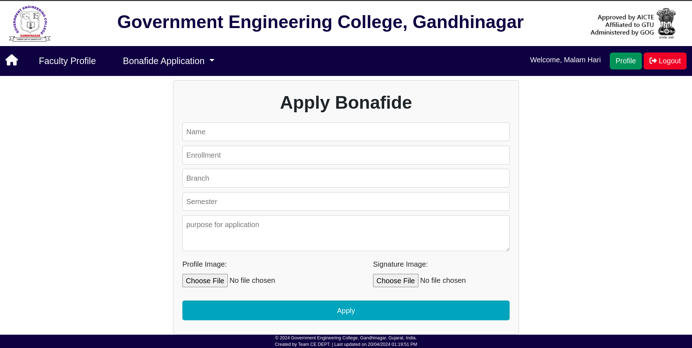
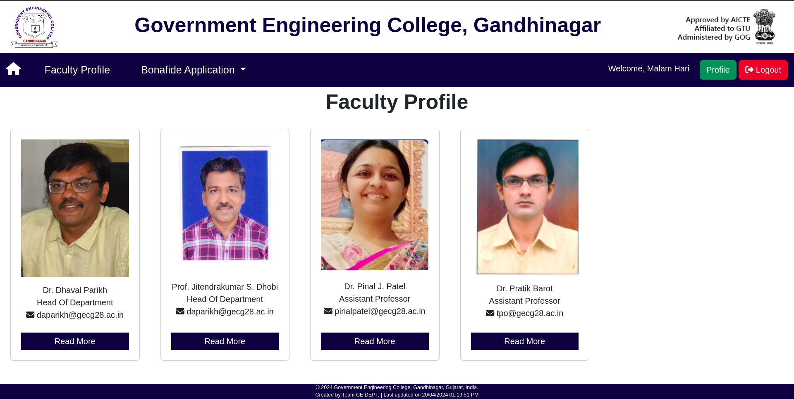

# Student Portal

This repository contains the source code for the Student Portal project, developed for Government Engineering College Gandhinagar.

## About

The Student Portal is designed to provide a platform for students and faculty of Government Engineering College Gandhinagar to interact and manage various academic activities. It includes features such as:

- Login for both teachers and students
- Faculty profiles
- Student bonafide application and status tracking
- Teacher approval and history tracking

## How to Run (Windows 11)

### Prerequisites

- XAMPP Server

### Installation Steps

1. **Install XAMPP Server**

   - Download and install [XAMPP](https://www.apachefriends.org/index.html) server.
   - After installation, start MySQL and Apache servers. This can usually be done by opening XAMPP Control Panel and clicking on the "Start" buttons next to Apache and MySQL.

2. **Download Project**

   - Download the project zip file from [here](https://github.com/HariMalam/student-portal.git).
   - Extract the downloaded zip file into the `htdocs` folder of your XAMPP installation. (Usually located at `C:\xampp\htdocs`)

     You can do this by following these steps:

     - Open your web browser and visit [https://github.com/HariMalam/student-portal.git](https://github.com/HariMalam/student-portal.git).
     - Click on the green "Code" button and select "Download ZIP".
     - Once downloaded, extract the contents of the ZIP file into the `htdocs` folder.

3. **Navigate to Project Directory**

   - Open a terminal and navigate to the `student-portal` folder inside `htdocs`.

     ```bash
     cd C:xampp\htdocs\student-portal
     ```
   - Create Folders inside `student-portal`
      ```bash
     mkdir certificates
     mkdir uploads
     ```
     

4. **Set Up TCPDF**

   - Inside the `Generate` folder, create a folder named `tcpdf`.
   
      ```bash
     mkdir tcpdf
     ```
   - Download [TCPDF](https://github.com/tecnickcom/TCPDF) and extract its contents into the newly created `tcpdf` folder.

5. **Import Database**

   - Open phpMyAdmin in your browser by going to `http://localhost/phpmyadmin`.
   - Create a new database named `student-portal`.
   - Go to the Import section and import the SQL file located at `student-portal/database/student-portal.sql`.

6. **Access the Website**
   - Now, you can access the website by going to `http://localhost/student-portal` in your web browser.

### Preview






### Note

- Make sure XAMPP servers (Apache and MySQL) are running.
- Verify that the paths mentioned in the instructions match your XAMPP installation directory.
- For any issues, refer to the project documentation or contact the project contributors.
